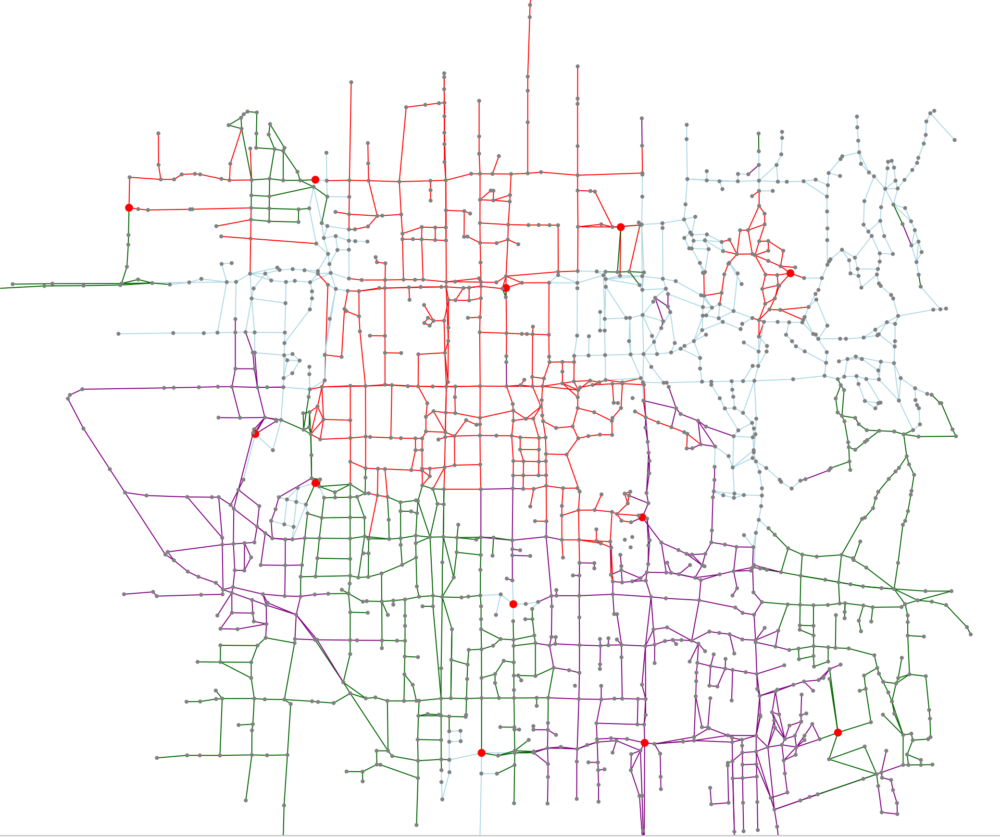

# ICFP Contest 2017 - The Flux Ambassadors

## Background

The [ICFP Programming Contest](https://en.wikipedia.org/wiki/ICFP_Programming_Contest) is a prestigious annual global coding contest in which teams from around the world build programs that compete against each other. I (Steve) had [entered solo in 2015](https://github.com/purcell/icfpc2015), and with [other colleagues in 2016](https://github.com/purcell/icfpc2016).

For 2017 I was joined by a crack coding team composed of Timothy Barraclough, Pragya Mohan and Kieran Trezona-le Compte. We were all friends and colleagues at Flux Federation (formerly [Powershop](http://www.powershop.co.nz/)) in windy Wellington, New Zealand, though I had just left the company the day before the contest and was officially _funemployed_ for a week.

## The task

[This year's challenge](https://icfpcontest2017.github.io/) was to write programs that would play each other on a network of rivers and build links from sites designated as "mines" to other locations on the network. Players take turns claiming rivers, and points were awarded according to the length of the links. Rule extensions were published at various points during the contest.

Teams could play each other online, but maps were also available for local testing, and the eventual official scoring would take place _offline_ on the organisers' hardware for both the first 24 hours of the contest (the "Lightning Round") and the full 72-hour period. The offline `punter` programs would be allowed to output and read back their state, but not to access the network or file system.

## Lightning round

We gathered in the office and started around 8am New Zealand time - 8 hours into the contest - and worked for about 14 hours on our entry for the initial 24-hour Lightning Round. It was a foregone conclusion that we would be using Haskell, though only Kieran and I had written a non-trivial amount of it, and we are still far from being experts.

Experience has taught that good visualisation tools are valuable in the ICFP contests, because they are what enable you to iterate on your strategy with rapid feedback, so we quickly made some basic types to represent maps and moves, and Kieran and Pragya set about rendering them into SVG images.

In the meantime, Timothy and I worked to write JSON serialisation/de-serialisation code for the map format, and to implement an offline player program that conformed to the problem specification and sent/received JSON messages. This was pretty straightforward thanks to the Aeson library.

Friends suggested various graph traversal algorithms that might help our strategy, but our initial cut was to simply consider all available bridges and weight them using a heuristic that favoured bridges connected to the most mines and/or bridges we has already claimed. We had no code to test this, because we'd gambled on waiting for the offline-to-online adaptor program the organisers has promised to publish.

The adaptor program was published in good time (ie. after a sunny walk and some lunch), but didn't work for us immediately, and it took a couple of hours of frustrating debugging to discover that we had not been flushing standard output from our offline `punter` program. (I had learned this lesson multiple times years ago, and forgotten it again over a few recent years of web-focused development.)

It turned out that our initial simplistic strategy was pretty effective against most opponents we encountered, so we spent a little time figuring out how to easily package our program on the supplied VM image, and submit it for judging.

We couldn't easily incorporate the "Futures" rules extension into our program, and it wasn't clear that it was even beneficial, so we skipped this.

We missed having a proper leader-board of team rankings, as was typical in previous contests. Having made a submission late in the evening, there was no immediate feedback about how it performed, or even whether it was well-formed. Partly because of this, we decided not to to stay awake until the end of the round, and to instead reconvene at a relaxed time in the morning.

## Day 2

Our goal for the second 24-hour period was to improve our program by iterating on our strategy. We spent a while hung up on the idea of automatically tuning the weights of our heuristic, but eventually concluded that it would instead be better to consider other factors.

We decided to favour bridges on direct paths between mines, for which purpose we found the excellent [Haskell FGL library](https://hackage.haskell.org/package/fgl-5.6.0.0). We pre-computed those direct paths at set-up time, then stored them in the program's state, and used them later to prioritise corresponding rivers.

To find out whether our strategy was improving, we wrote a rough simulator that would run multiple strategies against each other on a given map. This involved implementing scoring according to the game rules. The simulator confirmed that our new strategy was better.

Our simple visualiser also showed that the new strategy was smarter. It was hard to gauge our progress relative to other teams, though, and our visualisation code wasn't sophisticated enough to let us inspect and replay games we played on larger maps with real opponents: in hindsight, the whole day should probably have been spent on making a really great visualiser. Kieran eventually set about doing this using Elm, which was an ideal choice, but we didn't get to something we could use.

We ignored the Splurges rules extension, which allowed players to pass for multiple turns then claim several rivers at once, since no part of our strategy was set up for actively planning multiple moves ahead.

## Day 3

In the final 24-hour chunk, most of the team was back at work, and we had lost our momentum somewhat. I - funemployed and at home - dived into strategy improvements in the second half of the day.

The FGL library pointed me towards [Minimum Spanning Trees](https://en.wikipedia.org/wiki/Minimum_spanning_tree), which are the cheapest paths by which to reach all the points on a graph, given that the graph's edges can have varying costs.

My approach, then, was to compute Minimum Spanning Trees from every mine, where the cost of each river we already owned would be zero, and every other river would cost a fixed amount. Given the rivers in all those spanning trees, I'd then prioritise the ones seen most frequently. And since the MSTs would be recomputed each turn, they would adapt to other players' claims and obstructions. In the event that critical rivers were claimed by other users, this strategy would even use the Options rule extension to use those if necessary.

It took a long time to pull this together, because my poor brain was flagging. Eventually I was able to run it, and it crushed our old strategy on an initial test. But: tragedy! In other tests, it completely failed to find rivers, because I'd clearly made a stupid error in my code or assumptions (or both!).

This hard failure was a sad twist at this late stage, so in a stroke of evil genius I employed a horrible hack, making the new strategy call the old one for help rather than die ignominiously if it detected that it had failed. Amazingly, this cringe-worthy hybrid strategy seemed better still, so we shipped it as our final submission.

Who knows if it will run properly and work for the judges? We're keenly awaiting the scores.

## Conclusions and lessons learned

Needless to say, the contest was a lot of fun, for all sorts of reasons. Having a great team is the biggest one -- in our case, we all had compatible work styles and complementary skills and thinking styles. Plus, our food delivery preferences were closely aligned. (Thanks team!)

I'm convinced Haskell was an ideal technology choice: for refactoring and quickly extending code without breaking what you've already got working well, it just seems unreasonably bullet-proof. Yes, you have to think hard about types, and it takes some practice before you can do so, but in focusing on computations, you're considering a static picture of how the program produces values: for the most part, you don't have to think about the factor of time, e.g. "in which order will these chunks of code be called," or "will this be null when this. It's very freeing. We wrote around 1200 lines of Haskell over the weekend, but if you want to see really nice Haskell, maybe look at some other teams' code instead...

So what did we miss, and what would we do differently?

Most obviously, we should have spent much more time on building a really great visualiser. It's surprising how much you can get done in a short time, but you have to start soon enough: the key advantage of having a bigger team is that you can afford to turn the "nice-to-haves" into superpowers. This will be a key focus next year!

Next, we missed the boat on our local simulation. We should have emphasised supporting multiple strategies early on, and not only created random/simple strategies to compete against, but also run simulations across all available maps, and with permutations of play order. This would have helped us have greater confidence that our strategies had improved. Additionally, if we had strictly enforced the game rules in our simulator, that would have been easy, and might have protected against invalid strategies.

And finally, there are often little concerns that lurk in the back of your head taking up brain cycles until you've captured them in code. For example, runtimes were capped to 1 second, but we never measured or enforced them in our code: for this reason, I'm still not sure that we'll reliably be below that threshold on the larger maps using our final strategy. It wouldn't have taken much code to enforce this: not only would this have removed any worry, but writing that code would have been just the sort of task that sometimes provides a welcome break from the big "thinking harder" challenges.

I'm already looking forward to putting these lessons into practice not only in next year's contest, but in my day job!

-Steve Purcell

[sanityinc.com](http://www.sanityinc.com/)

[@sanityinc](https://twitter.com/)
